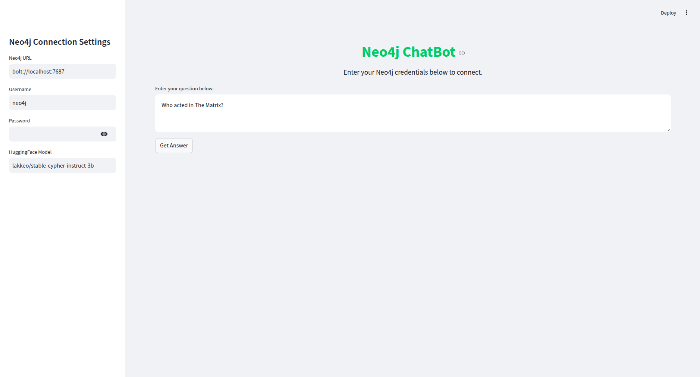
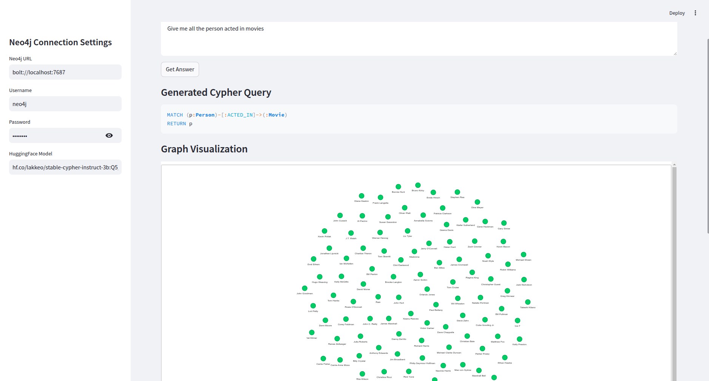
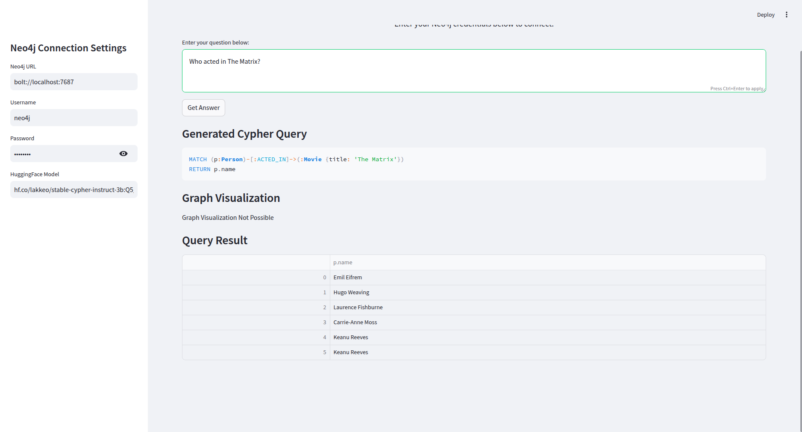

# Moviedb_neo4j Chatbot

*This project is designed to work with the provided Movie Database. Using a different database may lead to unexpected errors.*

## Prerequisites

- Install **Miniconda and Conda**
  - Download and install from [Miniconda](https://docs.conda.io/en/latest/miniconda.html).

- Install **Ollama and Hugging Face Model**
  - Install Ollama from [Ollama](https://ollama.ai/).
  - Search for `lakkeo/stable-cypher-instruct-3b` on **Hugging Face**.
  - Click **Use this model** and select **Ollama**.
  - Choose the above-mentioned model.
  - Copy the command shown (e.g., `ollama run hf.co/lakkeo/stable-cypher-instruct-3b:Q8_0`).
  - Open the terminal and run the copied command.
  - The first installation may take some time, but subsequent runs will be faster depending on your hardware specs.

- Install **Neo4j Desktop and Setup Database**
  - Download the **Neo4j Desktop App Image** from the **Deployment Center**.
  - Select the **Linux App Image** and download it.
  - Navigate to the directory where the file is downloaded:
    ```bash
    cd /path/to/downloaded/file
    ```
  - Set the file as executable and run it:
    ```bash
    chmod +x <file_name>
    ./<file_name>
    ```
  - Paste the activation key when prompted.
  - Turn on the **Movie Database**.
  - Navigate to **Apps** and start the **Browser**.
  - Open the **Neo4j Browser App**.
  - Copy the contents of `MoviesDataset.txt`, paste them into the Neo4j Browser and Execute it to store those values in the databse.

- Install **Git and Clone the Repository**
  - Ensure Git is installed.
  - Clone the repository:
    ```bash
    git clone https://github.com/Jitmandal051004/neo4j_chatbot_py.git <repo_folder_name>
    cd <repo_folder>
    ```

- Set Up the **Conda Environment**
  - Download the `environment.yml` file.
  - Create and activate the environment:
    ```bash
    conda env create -f environment.yml
    conda activate <your_env_name>
    ```

## Running the Project

- Run the Python script:
  ```bash
  python text2cypher.py
  ```
- Start the Streamlit app:
  ```bash
  streamlit run QueryApp.py
  ```
- Open the browser and fill in the **password**.
- Write your query and execute it.

## Example Queries

- "Show me all the movies available."
- "Who acted in The Matrix?"
- "Which movies were directed by Lana Wachowski?"
- "List all co-actors of Keanu Reeves."
- "Find me all movies released after the year 2000."
- "Show movies that feature both Keanu Reeves and Laurence Fishburne."
- "Who produced The Matrix?"
- "Find all actors born after 1970."
- "List movies with the tagline containing 'freedom'."
- "Get all movies sorted by release year."

## Troubleshooting

- If a query does not return the expected results, click **Submit** again.
- The model may sometimes generate excessive text or hallucinate responses.
- This happens because large language models predict responses based on patterns in training data.
- If a query returns incorrect results, try rephrasing and submitting again.

## ENJOY

### 📌 WebApp User Interface


### 📊 Graphical Visualization


### 📋 Tabular Representation


